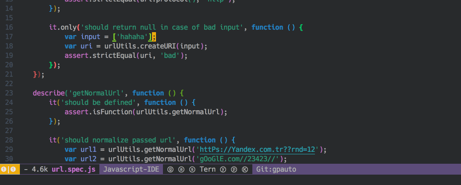

## Emacs-BPR (Background Process Runner)
This package provides logic for async process execution.

It's similar to `async-shell-command`, but:
- `bpr` spawns processes asynchronously without displaying output buffers.
- `bpr` shows progress messages for running processes in echo area.
- `bpr` can display buffer with process output in case of errors.
- `bpr` can use `projectile` for assigning process directory.
- `bpr` can format process output (understands ansi escape codes).
- you can set different options for different processes.

`bpr` is very handy for running tests/builds, but you can run any processes with it. 

## Example
Given this configuration:
```elisp
(require 'bpr)

;; Set global config for bpr.
;; Variables below are applied to all processes.
(setq bpr-colorize-output t)
(setq bpr-close-after-success t)

;; define function for running desired process
(defun run-tests ()
  "Spawns 'grunt test' process"
  (interactive)
  ;; Set dynamic config for process.
  ;; Variables below are applied only to particular process
  (let* ((bpr-scroll-direction -1))
    (bpr-spawn "grunt test --color")))

;; set key-binding
(define-key global-map "\C-ct" 'run-tests)
```
You get this behavior for success:

And this for error:


What's happening:
- User enters predefined key-binding, which invokes function `run-tests`.
- `bpr-spawn` starts async process `grunt test --color` and writes progress messages in echo area.
- If process ends successfully - success message is being shown.
- If process ends with error - error message is being shown and window with output buffer is being opened.

## Installation
### MELPA
Use `M-x package-install bpr` and write `(require 'bpr)` in your conifg.

### Manually
```elisp
;; If you have cloned this repo into `~/some-path/emacs-bpr/`
(add-to-list 'load-path "~/some-path/emacs-bpr/")
(require 'bpr)
```

## Configuration
If you want to set options globally for all processes:
```elisp
(require 'bpr)
(setq bpr-colorize-output t) ;; use ansi-color-apply-on-region function on output buffer
(setq bpr-process-mode #'comint-mode) ;; use comint-mode for processes output buffers instead of shell-mode
```

If you want to set options to particular process, set them dynamically right before `bpr-spawn`:
```elisp
(let* ((bpr-erase-process-buffer nil) ;; don't erase process output buffer before starting this process again.
       (bpr-show-progress nil)) ;; don't show progress messages (only success/error messages will be displayed)
    (bpr-spawn "ping -c 4 www.wikipedia.org"))
```

Default directory for processes is `default-directory` of current buffer, but with `projectile` installed, `bpr` would use `projectile-project-root` function. To disable projectile support, set `bpr-use-projectile` to nil. If you want to set custom logic for project root detection, just reimplement `bpr-try-get-project-root` function.

Default major mode for process's output buffer is `shell-mode`. Note, that this buffer is only showed in case of error, but you can manually open it at any time by `bpr-open-last-buffer`. Template for buffers names: `*process-name (process-directory)*`

### Commands
###### `bpr-spawn`
Spawns passed shell command.

###### `bpr-open-last-buffer`
Opens the buffer of the last spawned process.

### Options
###### `bpr-close-after-success nil`
Indicates whether the process output window is closed on success.

###### `bpr-open-after-error t`
Indicates whether the process output window is shown on error.

###### `bpr-window-creator #'split-window-vertically`
Function for creating window for process.

###### `bpr-process-mode #'shell-mode`
Mode for process's buffer.

###### `bpr-process-directory nil`
Directory for process.
If not nil, it will be assigned to default-direcotry.
If nil, standart default-direcotry will be used,
or projectile-project-root, if it's available and bpr-use-projectile isn't nil.

###### `bpr-use-projectile t`
Whether to use projectile-project-root (if available) for process's directory.

###### `bpr-erase-process-buffer t`
Indicates whether the process buffer is erased at the start of the new process.

###### `bpr-scroll-direction 1`
Scroll text in error window, -1 for scroll up, 1 - scroll down.

###### `bpr-show-progress t`
Whether to show progress messages for process.

###### `bpr-poll-timout 0.2`
Progress update interval.

###### `bpr-colorize-output nil`
Wheter to colorize process output buffer. For this operation `ansi-color-apply-on-region' is used.

### Examples for different use cases
##### Running tests
```elisp
(defun my-test-runner ()
  "Spawns test process"
  (interactive)
  (let* ((bpr-scroll-direction -1) ;; scroll to the top of the output window (wich is being shown in case of error)
         (bpr-close-after-success t)) ;; close error window after process ended successfully (if it's not already closed)
    (bpr-spawn "rake tests")))
```
##### Running builds
```elisp
(defun my-build-runner ()
  "Spawns build process"
  (interactive)
  (let* ((bpr-process-directory "~/chromium/") ;; spawn process in this directory (instead of default-directory or projectile-project-root)
         (bpr-poll-timout 60.0)) ;; show progress messages once in 60 seconds
    (bpr-spawn "make long-build")))
```
